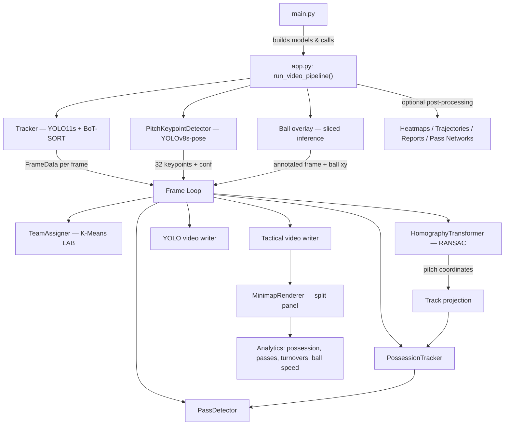

# Architecture Walkthrough

Deep dive into the football player detection & tracking pipeline — how data flows from raw video to annotated output videos with live analytics.

---

## Pipeline Overview



---

## Frame Loop Flow

Each frame passes through these steps in `run_video_pipeline()`:

1. **Tracker yields FrameData** — `tracker.frames()` streams `FrameData` objects (frame image, list of `Track`s, metadata). Only `Player`, `Goalkeeper`, and `Referee` classes are kept.

2. **Ball overlay** — The separate ball model runs sliced inference (640×640 tiles) on the frame, annotates the ball trail, and returns the ball `(x, y)` pixel position.

3. **Team assignment** — Three-phase process:
   - Frames 1–60 (every 5th): `team_assigner.fit()` collects jersey color features.
   - Frame 61: `team_assigner.train_model()` fits K-Means.
   - Frames 62+: `team_assigner.predict()` assigns team IDs with EMA smoothing.

4. **Pitch keypoint detection** — The pose model detects 32 pitch landmarks. Keypoints are filtered by confidence threshold, finite-value check, and in-bounds check.

5. **Homography estimation** — Valid keypoints are matched to world coordinates (from `SoccerPitchConfiguration`) and passed to `HomographyTransformer` which calls `cv2.findHomography(..., RANSAC)`. The result goes through gate checks before acceptance.

6. **Track projection** — Each track's `foot_position` is transformed to pitch coordinates (centimeters) using the homography matrix. Positions are EMA-smoothed and jump-clamped.

7. **Possession update** — `PossessionTracker` finds the nearest player/goalkeeper to the ball within a pixel distance threshold, with temporal smoothing to prevent flickering.

8. **Pass & turnover detection** — `PassDetector` monitors possessor transitions: same-team change = completed pass, cross-team change = turnover. Distance constraints filter out false positives.

9. **Ball speed calculation** — Consecutive ball positions are projected to pitch coordinates and the displacement over `dt` gives speed in km/h.

10. **YOLO video frame** — Raw detections with class-colored ellipse markers, ball trail overlay, and possession indicator (yellow triangle above possessor). Written to the YOLO output video.

11. **Tactical video frame** — Team-colored ellipse markers + possession indicator on the main frame, with a split panel below containing the minimap and live analytics. Written to the tactical output video.

---

## Core Data Structures (`src/core/`)

### `Detection` (`types.py`)
Frozen dataclass representing a single detection: `bbox`, `conf`, `cls_name`, `cls_id`, `team_id`, `team_conf`, `pitch_x_cm`, `pitch_y_cm`.

### `Track` (`types.py`)
Mutable dataclass wrapping `Detection`. Adds:
- `track_id` — persistent identity across frames (from BoT-SORT)
- `kit_feat_ema` — EMA feature buffer for team assignment smoothing
- Properties: `center`, `foot_position`, `pitch_position_cm`
- Pitch coordinates are in **centimeters** (120m × 70m → 12000 × 7000 cm)

### `FrameData` (`types.py`)
Container for one frame: `frame_idx`, list of `Track`s, `width`, `height`, `img` (numpy array).

### `SoccerPitchConfiguration` (`pitch.py`)
Defines 32 pitch landmark vertices in centimeters. The `vertices` list order is the ground-truth correspondence for homography. Pitch dimensions: 12000 cm × 7000 cm.

---

## Vision Layer (`src/vision/`)

### `Tracker` (`tracker.py`)
Wraps a YOLO model (YOLO11s, imgsz=960). The `frames()` method is a generator that calls `model.track()` in streaming mode and yields `FrameData` per processed frame. Per-class confidence thresholds: `conf_ball=0.15`, `conf_player=0.25`.

### `PitchKeypointDetector` (`pitch_keypoint_detector.py`)
Wraps a YOLOv8s-pose model for 32 pitch landmark keypoints. Picks the highest-confidence detection when multiple pitch detections occur. Always returns fixed-size `(32, 2)` xy + `(32,)` conf arrays.

### `BallTracker` / `BallAnnotator` (`ball.py`)
Uses `supervision.InferenceSlicer` to run the ball model on 640×640 slices. `BallTracker` picks the detection closest to a recent centroid buffer. `BallAnnotator` draws a trailing path of recent ball positions.

---

## Analytics Layer (`src/analytics/`)

### Homography

**Two implementations coexist:**

| Class | File | Used by | Description |
|-------|------|---------|-------------|
| `HomographyTransformer` | `homography_simple.py` | Pipeline (`app.py`) | Thin wrapper: `cv2.findHomography(..., RANSAC, 150)` |
| `PitchHomographySimple` | `homography.py` | Diagnostic scripts | Stateful, multi-mode world transforms (identity / flip_x / flip_y / flip_xy) |

#### Homography State Machine

```
valid ──→ fallback ──→ invalid
  ↑          │
  └──────────┘ (new valid frame)
```

- **valid** — New homography accepted after passing all gate checks.
- **fallback** — Current frame rejected; previous H reused for up to `max_stale_frames` (default 60).
- **invalid** — Stale budget exhausted; no projection until a valid frame arrives.

#### Gate Checks

Applied to each candidate homography before acceptance:

| Check | Default | Description |
|-------|---------|-------------|
| Min inliers | 4 | Minimum RANSAC inlier count |
| Min inlier ratio | 0.5 | Fraction of points that must be inliers |
| Min X span (cm) | 1200 | Inlier world-coordinate spread on X axis |
| Min Y span (cm) | 1000 | Inlier world-coordinate spread on Y axis |
| Max reproj error (cm) | 120 | Median reprojection error upper bound |

### `TeamAssigner` (`team_assignment.py`)

K-Means clustering on jersey LAB (a, b) color channels with grass masking:
- **Preprocessing** — Crop torso region, mask out grass-colored pixels.
- **Feature extraction** — Median LAB color statistics from the jersey patch.
- **Fit** (frames 1–60, every 5th) — Collect features.
- **Train** (frame 61) — Fit K-Means with 2 clusters.
- **Predict** (frames 62+) — Assign team IDs with EMA smoothing to prevent flickering.
- **Goalkeepers** — Resolved separately by proximity to team centroid on the pitch image.

### `PossessionTracker` / `TeamPossessionTracker` (`possession.py`)

- `PossessionTracker` — Proximity-based: finds the nearest player/GK foot position to the ball, within `max_distance_px` (default 100px). Uses temporal smoothing (`confirm_frames`, `lose_frames`, `switch_frames`) to prevent rapid flickering.
- `TeamPossessionTracker` — Aggregates possession duration per team. Exposes `percentages()` for live display.

### `PassDetector` (`pass_detection.py`)

Monitors possessor transitions:
- **Same team, different player** → completed pass (if distance is within 3m–60m).
- **Different team** → turnover event.

Stores `PassEvent` and `TurnoverEvent` dataclasses with positions, distances, and frame indices. Exposes `summary()` and `turnover_summary()` dicts.

### `PlayerMovementAnalyzer` (`player_movement.py`)

Aggregates per-track distance, speed, and pitch coverage from smoothed pitch coordinates. Used by post-processing modules.

---

## I/O Layer (`src/io/`)

### `MinimapRenderer` (`minimap_renderer.py`)

Pre-builds a pitch canvas (green rectangle with field markings at scale) and overlays team-colored track dots.

**`render_split_panel()`** — Creates the tactical video's bottom panel:

```
┌─────────────────────────────────────────────────────┐
│                  Main tactical frame                 │
│          (team-colored markers + ball trail)          │
├──────────────────┬──────────────────────────────────┤
│                  │   Possession  [███████░░░░]      │
│    2D Minimap    │   Passes      [  5  |  3  ]      │
│   (pitch view)   │   Turnovers   [  2  |  1  ]      │
│                  │   Ball speed: 42 km/h             │
│                  │   H: valid (12 pts)               │
└──────────────────┴──────────────────────────────────┘
```

### `CsvWriter` (`csv_writer.py`)

Writes per-frame, per-track rows with full homography diagnostic columns. Used by diagnostic scripts, not wired into the main pipeline by default.

---

## Output Videos

### YOLO Tracking Video
`yolo_players_referees_goalkeepers_ball.mp4`

- Class-colored ellipse markers (Player=blue, Goalkeeper=green, Referee=red)
- Track IDs as labels
- Ball trail overlay (from separate ball model)
- Possession indicator (yellow triangle above possessor)

### Tactical Video
`team_assignment_homography_minimap.mp4`

- Team-colored ellipse markers (Team 0=pink, Team 1=cyan, Referee=red)
- Possession indicator (yellow triangle)
- Split panel below the frame with:
  - 2D pitch minimap with player dots
  - Possession percentage bar
  - Pass count comparison
  - Turnover count comparison
  - Ball speed (km/h)
  - Homography status text

---

## Post-Processing

Optional outputs generated after the main frame loop, enabled via CLI flags:

| Flag | Output | Description |
|------|--------|-------------|
| `--heatmaps N` / `--heatmap-track ID` | `heatmaps/*.png` | Player pitch heatmaps (Gaussian KDE on projected positions) |
| `--trajectories` / `--trajectory-track ID` | `trajectories/*.png` | Pitch trajectory plots (all players, per-team, top-k by distance) |
| `--report` | `player_summary.csv`, `team_summary.csv` | Distance, speed, and coverage stats per player and per team |
| `--pass-network` | `pass_network/*.png` | Per-team pass network graph overlaid on pitch |

---

## Models

| File | Purpose | Architecture | Input Size |
|------|---------|--------------|------------|
| `best_players_gk_ball_960_s_e502.pt` | Player / GK / Referee | YOLO11s | 960 |
| `pitch_kpts32_y8s_640_e500_AO.pt` | Pitch keypoints (32 landmarks) | YOLOv8s-pose | 640 (run at 960) |
| `ball_tracking_1280_e300.pt` | Ball tracker (sliced inference) | YOLO11s | 1280 (sliced) |
